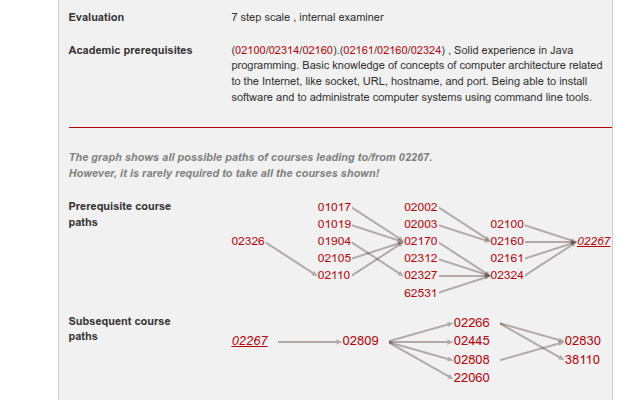

# 🎓 DTU courses extension (OPEN-SOURCE)
This project is a Chrome extension for DTU's course website that enables one to see all prerequisite and subsequent courses of any course. 

I made this extension because it was a very needed feature. I probably won't be able to maintain it for very long, but I'll do my best. This is also why I will make this project open-source (open for suggestions).

**If you like the extension, please introduce it to your fellow students (and maybe leave a star on the repo <3)**

Enjoy!

# 🤓 How to
1) Install Chrome extension [here](https://chromewebstore.google.com/detail/dtu-extended-course-overv/pfgokeibjgebafnamhbgkgfgbmhmgpde)
2. Below the ***Academic prerequisites*** section, 2 new sections will appear:
    - **Prerequisite course paths**
    - **Subsequent course paths**
3. For the prerequisite path, it will show the courses that lead to the *current* course, as well a the courses that lead up to those (and so on...)
4. For the subsequent path, it will show the courses that the *current* course leads to, as well as what those next courses lead to (and so on...). Note that it won't show other prerequisites for the courses in the "next layers".
5. Hovering over any course number in the two graphs will highlights its neighbours.

**Example (course 02267)** :

# 🔁 Feedback
I appreciate any kind of feedback, but for issues related to the extension, please create an [issue thread](https://github.com/Marcrulo/DTU-courses-extension/issues)

# 🧑‍💻 For developers
The project is structured in 2 parts: Scraping and processing the course graph structure, and the Chrome extension.

## 🕸️ Part A - Course graph
In `1_scrape_content.py`, we scrape the text of all valid course pages.

In `2_create_graph.py` we use [NetworkX](https://networkx.org/) to first create of big graph of all DTU courses, and afterwards create seperate subgraphs for each course (the ones displayed by the extension)

## 💻 Part B - Chrome extension
The logic for the extension is all contained in the `content.js` file, where the css is stored in `main.css`. For a brief overview, the file is structured like this:
1. Load relevant files
2. Run code as soon as files are loaded (using async)
3. Extend left-most div/table (the element with course type, name, points etc.)
4. Constructing tables structure, where the cells represent graph nodes (courses)
5. Render tables in HTML
6. Draw lines (edges) between cells, corresponding to the graph we computed. Lines are created using the "LeaderLine" package
7. Upon hovering, highlight node and its 1-hop neighborhood (highlight immediate neighbors in both directions)
